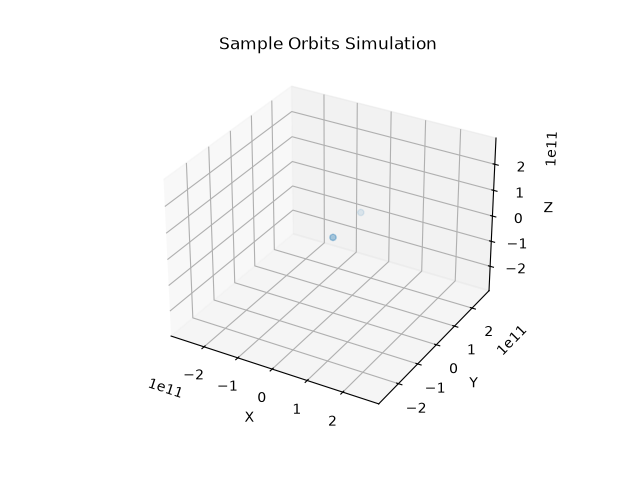

# Simulation of Orbital Mechanics and Multi-body Systems



## Setup

Required python libraries:

```bash
pip install numpy matplotlib
```

## Examples

Try some of these examples:

* Produce an animation of sample orbits:
  ```bash
  python3 simulation_sample_orbits.py`
  ```
